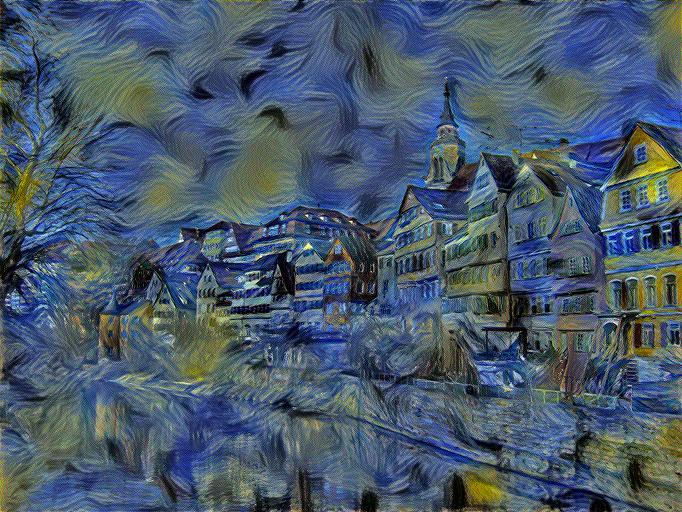

# Neural Style Transfer using VGG network

<p align="center">
    
    
</p>

<p align="center">
    
    
</p>


A PyTorch implementation of [Gatys et al.(2016)'s idea](https://www.cv-foundation.org/openaccess/content_cvpr_2016/papers/Gatys_Image_Style_Transfer_CVPR_2016_paper.pdf) with some code optimisation to reduce memory overhead. Also provide Jupyter Notebook for experiment in flexible. 

Added Support for non-square images.

## Packages
```YAML
dependencies:
  - python=3.12
  - pytorch
  - torchvision
  - tqdm
  - jupyter
  - matplotlib
```

- [environment.yml](./environment.yml) for `conda`
- [pyproject.toml](./pyproject.toml) for `uv`

## Usage
### Python
```python
python3 python/style_transfer.py -h
usage: style_transfer.py [-h] --content_img CONTENT_IMG --style_img STYLE_IMG [--use_gpu | --no-use_gpu]
                         [--style_weight STYLE_WEIGHT] [--content_weight CONTENT_WEIGHT]
                         [--learning_rate LEARNING_RATE] [--init_mode {random,content}] [--num_epochs NUM_EPOCHS]
                         [--saving_freq SAVING_FREQ]

options:
  -h, --help            show this help message and exit
  --content_img CONTENT_IMG
                        content image filename under data/input
  --style_img STYLE_IMG
                        style image filename under data/input
  --use_gpu, --no-use_gpu
                        use GPU
  --style_weight STYLE_WEIGHT
                        weight of style loss
  --content_weight CONTENT_WEIGHT
                        weight of content loss
  --learning_rate LEARNING_RATE
                        learning rate
  --init_mode {random,content}
  --num_epochs NUM_EPOCHS
                        number of epochs the program run
  --saving_freq SAVING_FREQ
                        saving frequency of intermediate images

```

**Setup conda environment:**
```shell
# Create conda env with config
cd "${PATH_TO_REPO}";
conda env create -f environment.yml;
conda activate nst;

# Run the program
python python/style_transfer.py --content_img content-1.jpg --style_img style-1.jpg --use_gpu

# When you finish, exit the conda environment
conda deactivate;
```

**Setup uv environment:**
```shell
# Create uv env with config
cd "${PATH_TO_REPO}";
uv sync;

# Run the program
uv run python/style_transfer.py --content_img content-1.jpg --style_img style-1.jpg --use_gpu
```

### Google Colab - Setup with Google Drive
1. Upload the repo to google drive

2. Open `${PATH_TO_REPO_IN_GDRIVE}/notebook/neural_style_transfer_experiment.ipynb`

3. Execute the following cells
```python
# Mount Google Drive
from google.colab import drive
drive.mount('/content/gdrive')
```

```python
# Change the current working directory
YOUR_WORKING_DIR_GDRIVE="MyDrive/Colab/neural-style-transfer/notebook"

import os;
os.chdir(f"/content/gdrive/{YOUR_WORKING_DIR_GDRIVE}")
print(os.getcwd())
```

## Acknowledgements
Useful repos:
- [Neural Style Transfer by Aleksa Gordić](https://github.com/gordicaleksa/pytorch-neural-style-transfer/tree/master)
- [Neural Style Transfer implementation from the book *Mastering PyTorch*](https://github.com/arj7192/MasteringPyTorchV2/tree/main/Chapter08)

Useful links:
- [PyTorch Tutorial: Neural Style Transfer](https://docs.pytorch.org/tutorials/advanced/neural_style_tutorial.html)

## License
